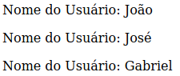

# Diretivas

Todas as **diretivas** do vue possuem o **v-**, como por exemplo os já ensinados **v-bind** e **v-on**, e nesta seção iremos introduzar novas diretivas para ajudar o seu desenvolvimento.

## V-IF

Ele possui um funcionamento bem simples: analiza a condição imposta ou variavel e em caso de **true** exibe no template, e em caso de **false** ele não exibe.

Exemplo:

```html
<template>
  <section v-if="mostrar">
    <p>1</p>
    <p>2</p>
    <p>3</p>
  </section>
</template>

<script>
export default {
  data() {
    return {
      mostrar: true
    };
  }
};
</script>
```

Neste caso o **v-if** está atribuindo ao estado **mostrar** a sua condição, e por **mostrar** ser um booleano verdade ele será exibido ao template, mas:

```html
<template>
  <section v-if="mostrar">
    <p>1</p>
    <p>2</p>
    <p>3</p>
  </section>
</template>

<script>
export default {
  data() {
    return {
      mostrar: false
    };
  }
};
</script>
```

Nessa situação, todo o **section**, **INCLUINDO** os conteúdos filhos **NÃO** serão exibidos no DOM

Por exemplo:

```html
<template>
  <section>
    <p v-if="mostrar">1</p>
    <p>2</p>
    <p>3</p>
  </section>
</template>

<script>
export default {
  data() {
    return {
      mostrar: false
    };
  }
};
</script>
```

Apenas um item(p) está sendo atribuido a condição, então em caso de mudanças no estado de **mostrar** apenas **p** sofrerá mutação.

---

Podemos encadear condições, parecido com a sintaxe de algumas linguagens como **C** e ao próprio **JavaScript**

```html
<template>
  <section>
    <p v-if="mostrar">1</p>
    <p v-else="mostrar">2</p>
    <p>3</p>
  </section>
</template>

<script>
export default {
  data() {
    return {
      mostrar: false
    };
  }
};
</script>
```

Também temos o **v-else-if**, mas iremos mudar um pouco a estrutura do código para ter sentido:

```html
<template>
  <section>
    <p v-if="mostrar === 1">Carlos</p>
    <p v-else-if="mostrar === 2">João</p>
    <p v-else>José</p>
  </section>
</template>

<script>
export default {
  data() {
    return {
      mostrar: 1
    };
  }
};
</script>
```

---

## V-FOR

O **v-for** não é nada mais nada menos que um **forEach**,ou seja, ele percorre um array inteiro que é atrelado podendo assim exibir os conteúdo no template.

Vamos mostrar um exemplo simples explicando os detalhes:

```html
<template>
  <section>
    <article v-for="item in lista" :key="item.id">
      <p>Nome do Usuário: {{ item.nome }} </p>
    </article>
  </section>
</template>

<script>
export default {
  data() {
    return {
      lista: [
        { id: 1, nome: "João"},
        { id: 2, nome: "José"},
        { id: 3, nome: "Gabriel"}
      ]
    };
  }
};
</script>
```

Irá ser exibido o seguinte:

<h1 align="center">
  
</h1>

* o que o **v-for** está fazendo é pegar a **lista**, definindo cada parte da lista como **item** e percorrendo ele do começo ao fim, com isso podemos exibir itens específicos dos Objects da nossa lista, no caso **item.nome**.

* para conseguir utilizar o **v-for**, precisamos passar uma **chave** usando a diretiva **v-bind**, no caso estamos passando o **id** como chave em **:key="item.id"**.

Podemos capturar o segundo argumento, assim passando como **key** diretamente:

```html
<template>
  <section>
    <article v-for="(item, index) in lista" :key="index">
      <p>Nome do Usuário: {{ item.nome }}</p>
    </article>
  </section>
</template>
```

o **v-for** não altera a maioria das diretivas, podendo usar normalmente, por exemplo:

```html
<template>
  <section>
    <article v-for="(item, index) in list" :key="index">
      <p v-if="item.id % 2 === 0">Par</p>
      <p v-else>Ímpar</p>
    </article>
  </section>
</template>
```

---

## V-MODEL

O **v-model** é usado para setar mudanças em uma variavel de **input**, por exemplo:

```html
<template>
  <section>
    <input v-model="input">
    <p>{{ input }}</p>
  </section>
</template>

<script>
export default {
  data() {
    return {
      input: undefined
    };
  }
};
</script>
```

Desta forma podemos atrelar diretamente uma variável que receberá o valor de uma entrada de dados, podendo assim manipular essa variável de forma flexiva.

* O funcionamento do **v-model** em **propriedades** tem a necessidade de emitir o evento de alteração de volta para o componente pai por meio do **$emit** do vue, se quiser saber como fazer, clique [aqui](https://blog.oddeven.ch/blog/how-to-make-reusable-form-input-element-in-vue-js-2-6-and-vue-js-3-0/).

* O **v-model** tem um funcionamento próprio para cada **type**, então recomendamos fortemente que olhe a [documentação](https://br.vuejs.org/v2/guide/forms.html) sobre o **v-model**.

Na próxima seção, iremos falar sobre **computed properties** e **watchers**, mostrando como podem ser úteis durante o seu desenvolvimento, te esperamos lá! :)