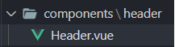
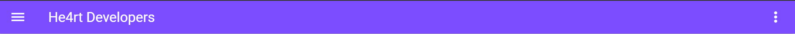
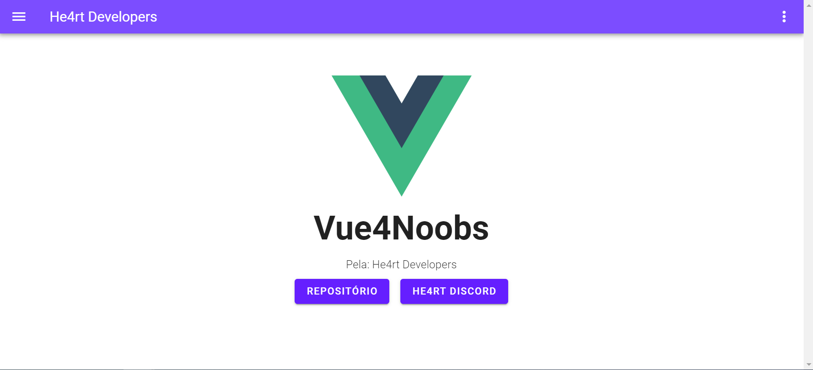

# Componentes

Nesta seção iremos explorar todo a vasta gama de componentes que o **Vuetify** nos disponibiliza.

## Projeto

A partir desse ponto de nosso curso, iremos utilizar o que iremos fazer para as outras seções, apenas implementando mais conteúdo, então faça o conteúdo que iremos passar e fique livre para implementar conteúdos adicionais :)

Não iremos disponibilizar o projeto por cada seção, apenas o projeto final, pois o intuito é que você faça. "Ah mas eu tive um problema", perfeito! Revise seu código e procure entender o **porquê** passou despercebido e os motivos de não ter funcionado. Entregar o projeto final pronto só vai enfatizar seus erros, que, em um momento em que você **não pode errar**(ou que pelo menos não deveria) poderá te atrapalhar.Você pode contar com a ajudar da [He4rt](http://discord.io/He4rt) sempre que quiser!

Iremos fazer uma simples landing page de começo, posteriormente uma aplicação com login e dashboard.

Durante todo o processo iremos utilizar o **Vuetify**, mas se preferir utilizar outra framework de CSS de seu agrado, fica á vontade também :)

## Landing Page

Vamos fazer a landing page baseado em: Header - Main

Tanto o **Header** quanto o **Footer** serão componentes reutilizáveis, enquanto o **Main** fará parte da view.

Dessa forma, conseguimos reaproveitar componentes e modularizar nosso projeto.

Para começar, vamos excluir todo o conteúdo inicial do **Vuetify** que está no nosso projeto:

* Excluir o componente HelloWorld.vue
* Vamos trocar o conteúde do App.vue para:

```html
<template>
  <v-app>
    <p>Hello He4rt</p>
  </v-app>
</template>

<script>
export default {
  name: 'App',
  data() {
    return {};
  },
};
</script>
```

## Header

Primeiramente, vamos fazer o Header.

Crie uma pasta em `./src/components/header/Header.vue`

<h1 align="center">
  
</h1>

E importe em seu componente App.vue:

```html
<template>
  <v-app>
    <section>
      <Header />
    </section>
  </v-app>
</template>

<script>
import Header from './components/header/Header.vue';

export default {
  name: 'App',
  components: {
    Header,
  },
  data() {
    return {};
  },
};
</script>
```

Para começar, vamos utilizar o **v-app-bar**:

```html
<template>
  <v-app-bar
    color="deep-purple accent-4"
    dense
    dark
  >
  </v-app-bar>
</template>
```

* Setamos a cor da nossa bar com o **color**, segundamente o **accent-4** acentua a coloração da bar

* Dense retira os paddings default do **v-app-bar**

* Dark quer dizer o tema que estamos usando, e esse tema por padrão deixa as letras com cor **branca**, iremos ter uma seção apenas para customizações, então não se preocupe.

Agora iremos acrescentar conteúdos:

```html
<template>
  <v-app-bar
    color="deep-purple accent-4"
    dense
    dark
  >
    <v-app-bar-nav-icon></v-app-bar-nav-icon>

    <v-toolbar-title>He4rt Developers</v-toolbar-title>
  </v-app-bar>
</template>
```

* O **app-bar-nav-icon** é o ícone sanduiche por padrão.

* Estamos criando um **título** com o **v-toolbar-title** com o nome da **He4rt**

Vamos agora setar uma lista de botões e espaçar para a **direita**

```html
<template>
  <v-app-bar
    color="deep-purple accent-2"
    dense
    dark
  >
    <v-app-bar-nav-icon></v-app-bar-nav-icon>

    <v-toolbar-title>He4rt Developers</v-toolbar-title>

    <v-spacer></v-spacer>

    <v-menu
      left
      bottom
    >
      <template v-slot:activator="{ on }">
        <v-btn icon v-on="on">
          <v-icon>mdi-dots-vertical</v-icon>
        </v-btn>
      </template>

      <v-list>
        <v-list-item
          v-for="({ nome, href }, index) in itemLista"
          :key="index"
          @click="() => {}"
        >
          <v-list-item-title>{{ titulo }}</v-list-item-title>
        </v-list-item>
      </v-list>
    </v-menu>
  </v-app-bar>
</template>

<script>
export default {
  data() {
    return {
      itemLista: [
        { nome: 'Registrar', href: '' },
        { nome: 'Entrar', href: '' },
      ],
    };
  },
};
</script>
```

* O template irá indicar para a lista quando ela deve exibir o conteudo.

* Usamos a desconstrução para passar dados no **v-for**.

* O **@click** irá ativar o estilo do nosso botão.

* Para ativar a lista também é possivel usando o **v-if**, mas vamo seguir usando o padrão do **Vuetify**.

* O **href** iremos utilizar para redireciar usando **rotas** futuramente.

Dessa forma, nosso **Header** ficará assim:

<h1 align="center">
  
</h1>

## Main

O nosso **main** será bem simples, com a logo da He4rt, descrição e botões:

```html
<template>
  <v-app>
    <div>
      <Header />
      <section class="d-flex flex-column justify-center align-center pt-10">
      
        <p class="font-weight-bold display-2 pt-5">Vue4Noobs</p>
        <span class="font-weight-light">Pela: He4rt Developers</span>
        <div class="my-2 p-5">
          <v-btn
            color="deep-purple mr-2"
            dark
            medium
            href="https://github.com/Novout/vue4noobs"
            target="_blank"
          >
            Repositório
          </v-btn>
          <v-btn
            color="deep-purple accent-4 ml-2"
            dark
            medium
            href="https://discord.io/He4rt"
            target="_blank"
          >
            He4rt Discord
          </v-btn>
        </div>
      </section>
    </div>
  </v-app>
</template>
```

* O **Vuetify** possui um sistema de classes [proprias](https://vuetifyjs.com/pt-BR/styles/flex/) para usar, recomendo **MUITO** que veja para melhor aproveitamento.

* Podemos usar o **:src** para procurar diretamente uma imagem em nossa aplicação, no caso em `./assets`.

* O **Vue** possui um sistema de caminho relativo usando o **@**, tendo o **@** começando da pasta **/src**

* Para baixar a imagem do Vue clique [aqui](https://en.wikipedia.org/wiki/Vue.js#/media/File:Vue.js_Logo_2.svg).

* Também podemos formatar [textos](https://vuetifyjs.com/pt-BR/styles/text/) e espaçar [itens](https://vuetifyjs.com/pt-BR/styles/spacing/) com o **Vuetify**.

* Fizemos uma forma simples de centralização, mas recomendamos que dê uma olhada no [grid](https://vuetifyjs.com/pt-BR/components/grids/).

* Fizemos a landing com a temática do curso, mas fique a vontade para customizar a landing page da forma que te agradar mais :)

* O **Main** poderia virar um componente também.

A cara final da nossa landing page:

<h1 align="center">
  
</h1>

Na próxima seção iremos mostrar em como customizar opção do **Vuetify**, assim colocando definições para todos os componentes, te vemos lá!