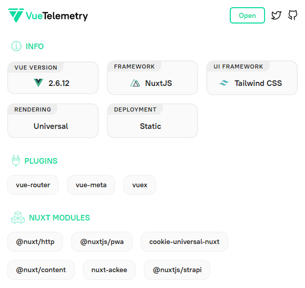

# Vuetelemetry

Desenvolvido pelo criador do `Nuxt.js`, o [Vuetelemetry](https://vuetelemetry.com/) foi desenvolvido para aprofundar os plugins de detecção de sites que usam `Vue`, mostrando detalhadamento o que foi utilizado.

* Exemplo do próprio site do Vuetelemetry

<h1 align="center">
  
</h1>

[Próxima Seção](./10%20-%20Obrigado.md)